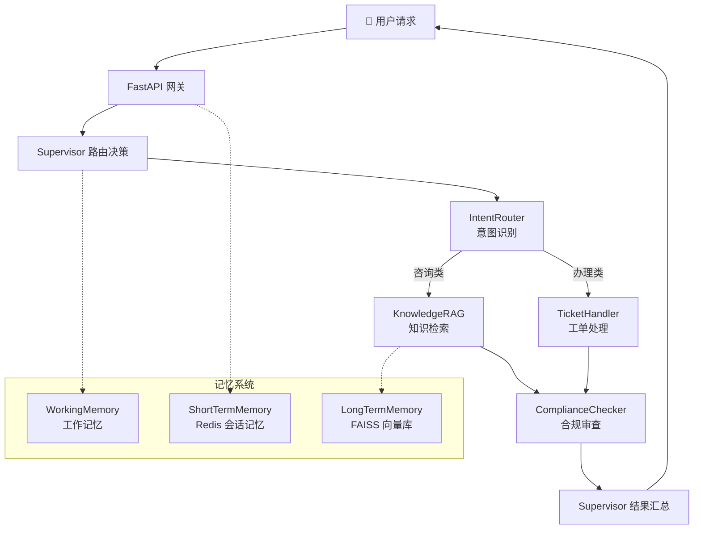

<div align="center">

# 🤖 智能客服多 Agent 系统

**基于 LangGraph Supervisor 编排的 Multi-Agent 智能客服系统**

[](https://www.python.org/)
[](https://github.com/langchain-ai/langgraph)
[](https://fastapi.tiangolo.com/)
[](LICENSE)

</div>

---

## 📖 项目简介

一套面向电商/金融场景的 **Supervisor 编排式 Multi-Agent 智能客服系统**。系统通过中央 Supervisor 协调多个专业化子 Agent 协同工作，覆盖从意图识别、知识检索、工单处理到合规审查的完整客服链路。

### 核心架构



### 请求流程

```
用户消息 → Supervisor 路由 → 子 Agent 并行处理 → 合规审查 → 结果汇总 → 返回
```

---

## ✨ 功能特性

| 模块 | 功能 | 说明 |
|------|------|------|
| **Supervisor** | 中央调度 | 分析意图、路由分发、结果汇总，基于 LangGraph StateGraph |
| **IntentRouter** | 意图识别 | 多级意图分类（咨询/投诉/交易/账户），实体提取 |
| **KnowledgeRAG** | 知识检索 | Query 改写 → 向量检索 → LLM 重排序 → 上下文生成 |
| **TicketHandler** | 工单处理 | 自动提取信息创建工单，支持优先级判定和状态流转 |
| **ComplianceChecker** | 合规审查 | 规则引擎 + LLM 两阶段审查，PII 脱敏，违规用语检测 |
| **MCP Server** | 工具协议 | Anthropic MCP 标准，JSON-RPC 2.0，工具注册/发现/调用 |
| **Memory** | 三层记忆 | 工作记忆（进程内）→ 短期记忆（Redis）→ 长期记忆（FAISS） |
| **Tracing** | 全链路追踪 | OpenTelemetry 集成，Agent 级 Span，支持 Jaeger/Zipkin |

---

## 🛠️ 技术栈

| 层级 | 技术 |
|------|------|
| **编排框架** | LangGraph + LangChain |
| **LLM** | OpenAI 兼容接口（DeepSeek / GPT-4o / 任意兼容模型） |
| **API 框架** | FastAPI + Uvicorn |
| **工具协议** | MCP (Model Context Protocol) + JSON-RPC 2.0 |
| **短期记忆** | Redis（带自动 TTL 和内存降级） |
| **长期记忆** | FAISS 向量数据库（支持切换 Milvus/Pinecone） |
| **可观测性** | OpenTelemetry（Traces + Metrics） |
| **部署** | Docker |

---

## 🚀 快速开始

### 前提条件

- Python 3.12+
- Redis（可选，用于短期记忆）

### 1. 克隆项目

```bash
git clone https://github.com/apollo990/Ecom-System.git
cd Ecom-System
```

### 2. 配置环境变量

```bash
cp .env.example .env
# 编辑 .env，填写你的 LLM API Key 和其他配置
```

### 3. 安装依赖

```bash
pip install -r requirements.txt
```

### 4. 启动 Redis（可选）

```bash
docker run -d -p 6379:6379 redis:7-alpine
```

### 5. 启动服务

```bash
python -m api.main
```

服务运行在 `http://localhost:8000`，访问 `/health` 确认启动成功。

### 6. 测试对话

```bash
curl -X POST http://localhost:8000/api/chat \
  -H "Content-Type: application/json" \
  -d '{
    "message": "理财产品A的收益率是多少？",
    "user_id": "user001"
  }'
```

---

## 📡 API 文档

| 方法 | 路径 | 说明 |
|------|------|------|
| `POST` | `/api/chat` | 主对话接口，发送消息获取 Agent 回复 |
| `GET` | `/api/history/{session_id}` | 获取会话历史 |
| `GET` | `/api/tools` | MCP 工具发现，列出所有可用工具 |
| `POST` | `/api/tools/call` | 直接调用指定 MCP 工具 |
| `GET` | `/api/metrics` | 系统指标（Agent 调用统计、工具日志） |
| `GET` | `/health` | 健康检查 |

### 对话请求示例

```json
{
  "message": "我要申请退款",
  "user_id": "user001",
  "session_id": "optional-session-id"
}
```

### 对话响应示例

```json
{
  "response": "工单已创建成功！\n\n📋 工单号: TK-20260401-A1B2C3\n...",
  "session_id": "uuid-session-id",
  "intent": "ticket_handler",
  "compliance_passed": true
}
```

---

## ⚙️ 配置参考

| 环境变量 | 说明 | 默认值 |
|----------|------|--------|
| `OPENAI_API_KEY` | LLM API 密钥（必填） | - |
| `OPENAI_BASE_URL` | API 地址 | `https://api.openai.com/v1` |
| `MODEL_NAME` | 模型名称 | `gpt-4o` |
| `REDIS_URL` | Redis 连接地址 | `redis://localhost:6379/0` |
| `VECTOR_STORE_TYPE` | 向量库类型 | `faiss` |
| `FAISS_INDEX_PATH` | FAISS 索引路径 | `./vector_store/faiss_index` |
| `OTEL_SERVICE_NAME` | 追踪服务名 | `smart-cs-multi-agent` |
| `OTEL_EXPORTER_OTLP_ENDPOINT` | OTLP 端点 | `http://localhost:4317` |
| `HOST` / `PORT` | 服务监听地址 | `0.0.0.0` / `8000` |

---

## 📂 项目结构

```
.
├── agents/                  # Agent 实现
│   ├── supervisor.py        #   Supervisor 编排核心（StateGraph 构建）
│   ├── intent_router.py     #   意图识别 Agent
│   ├── knowledge_rag.py     #   RAG 知识检索 Agent
│   ├── ticket_handler.py    #   工单处理 Agent
│   └── compliance_checker.py #  合规审查 Agent
├── api/
│   └── main.py              # FastAPI 入口，REST + SSE
├── mcp/
│   ├── mcp_server.py        # MCP 工具协议服务端
│   └── tools/               # MCP 工具注册
├── memory/
│   ├── working_memory.py    # 工作记忆（进程内）
│   ├── short_term.py        # 短期记忆（Redis）
│   └── long_term.py         # 长期记忆（FAISS 向量库）
├── tracing/
│   └── otel_config.py       # OpenTelemetry 追踪 & 指标
├── .env.example             # 环境变量模板
├── Dockerfile               # Docker 构建文件
├── requirements.txt         # Python 依赖
└── README.md
```

---

## 🐳 Docker 部署

```bash
docker build -t smart-cs-agent .
docker run -p 8000:8000 --env-file .env smart-cs-agent
```

---

## 🔧 扩展指南

- **接入新业务** — 在 `agents/` 下新增 Agent，在 `supervisor.py` 的 StateGraph 中注册节点
- **添加新工具** — 使用 `mcp_server.register()` 装饰器注册，自动加入工具发现列表
- **切换向量库** — 将 `long_term.py` 中的 FAISS 替换为 Milvus/Pinecone 客户端
- **生产化部署** — Redis 换为集群模式，FAISS 换为 Milvus，接入 Jaeger 做分布式追踪

---

## 📄 License

MIT
